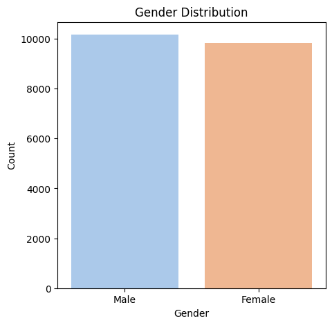
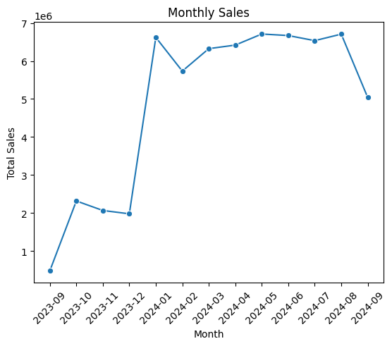
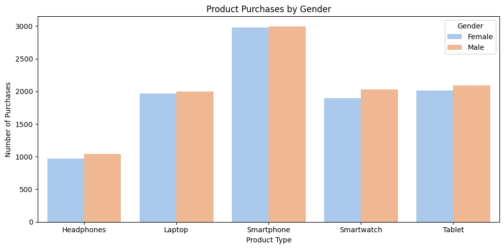
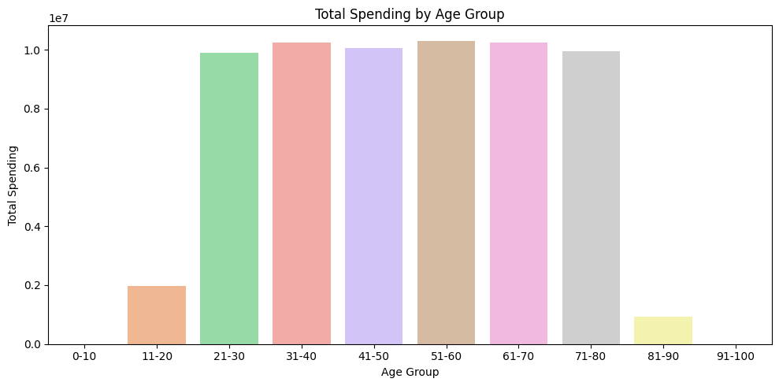
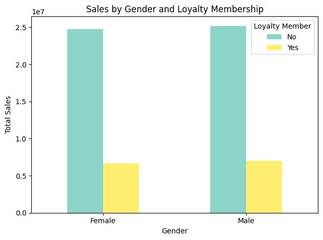
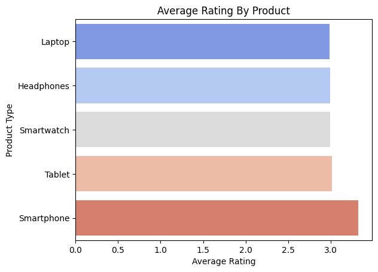
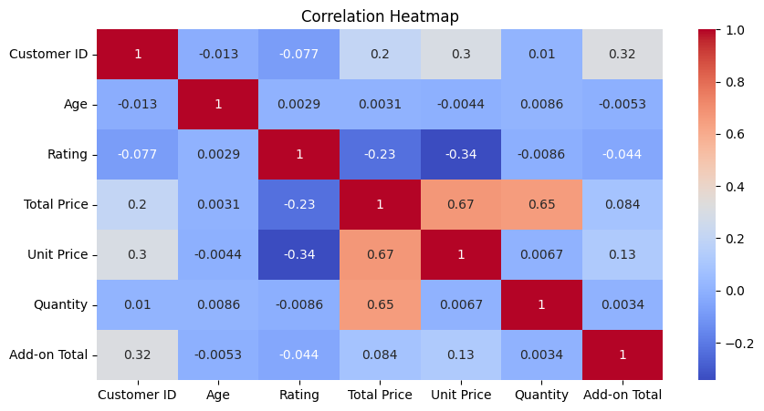
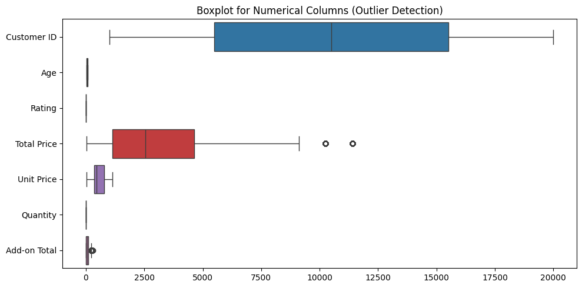

# Customer Purchase Behaviour Analysis Using Electronic Sales Data

## Executive Summary

Customer behaviour analysis plays a critical role in helping organizations understand purchasing patterns, optimize business strategies, and improve customer satisfaction. This project presents a comprehensive analysis of electronic sales transactions recorded between September 2023 and September 2024.

The primary objective of this project is to explore customer purchasing behaviour, identify key sales trends, evaluate product performance, understand customer demographics, and generate actionable business insights that can support strategic decision-making.

Using Python and various data analytics techniques, the project covers data cleaning, feature engineering, exploratory data analysis (EDA), visualization, correlation analysis, and outlier detection. The analysis transforms raw transactional data into meaningful business intelligence that can assist stakeholders in improving marketing effectiveness, customer engagement, inventory management, and overall sales performance.

---

# Business Problem

Modern retail businesses generate large volumes of transactional data every day. However, without proper analysis, organizations struggle to extract meaningful insights that can support business growth.

This project seeks to answer several important business questions:

* Which products are most popular among customers?
* Which customer segments generate the highest revenue?
* How does customer age influence purchasing behaviour?
* Are there noticeable differences in purchasing behaviour across genders?
* How effective is the loyalty membership program?
* Which products achieve the highest customer satisfaction ratings?
* What factors influence overall customer spending?

By answering these questions, businesses can better understand customer needs and make informed decisions to improve performance.

---

# Project Objectives

The key objectives of this project are:

* Analyze customer demographics and purchasing behaviour.
* Identify top-performing product categories.
* Evaluate customer satisfaction using product ratings.
* Examine spending behaviour across different age groups.
* Investigate sales performance trends over time.
* Analyze loyalty membership participation and its impact on sales.
* Explore relationships between key numerical variables.
* Detect unusual purchasing behaviour through outlier analysis.
* Generate business recommendations based on analytical findings.

---

# Dataset Overview

The dataset contains 20,000 electronic sales transactions recorded between September 2023 and September 2024.

Each transaction contains information related to customers, products, purchases, ratings, payment methods, shipping preferences, and loyalty membership.

### Dataset Features

| Feature           | Description                   |
| ----------------- | ----------------------------- |
| Customer ID       | Unique customer identifier    |
| Age               | Customer age                  |
| Gender            | Customer gender               |
| Loyalty Member    | Membership status             |
| Product Type      | Product category purchased    |
| SKU               | Product identifier            |
| Rating            | Customer rating               |
| Order Status      | Completed or Cancelled        |
| Payment Method    | Payment option selected       |
| Quantity          | Number of products purchased  |
| Unit Price        | Price per item                |
| Total Price       | Total transaction value       |
| Purchase Date     | Date of purchase              |
| Shipping Type     | Delivery method               |
| Add-ons Purchased | Additional products purchased |
| Add-on Total      | Cost of add-ons               |

### Dataset Source

Electronic Sales Dataset (Kaggle) https://www.kaggle.com/datasets/cameronseamons/electronic-sales-sep2023-sep2024

---

# Tools and Technologies

### Programming Language

* Python

### Development Environment

* Google Colab

### Libraries Used

* Pandas
* NumPy
* Matplotlib
* Seaborn
* Scikit-Learn

---

# Project Workflow

The project was completed using the following analytical framework:

1. Data Collection and Understanding
2. Data Cleaning
3. Feature Engineering
4. Exploratory Data Analysis (EDA)
5. Data Visualization
6. Correlation Analysis
7. Outlier Detection
8. Business Insight Generation
9. Recommendation Development

---

# Data Cleaning

Data cleaning was performed to improve data quality and ensure reliable analytical outcomes.

## Missing Value Analysis

The dataset was inspected for missing values using:

```python
df.isnull().sum()
```

Missing values were identified in the following columns:

### Gender

Missing values were replaced using the most frequently occurring category (mode).

```python
df['Gender'].fillna(df['Gender'].mode()[0], inplace=True)
```

**Reason**

Gender is a categorical variable, and replacing missing values with the mode helps preserve the original distribution of customer demographics.

---

### Add-ons Purchased

Missing values were replaced with "None".

```python
df['Add-ons Purchased'].fillna('None', inplace=True)
```

**Reason**

Missing values represented customers who did not purchase additional products.

---

## Data Validation

Following the cleaning process:

* Missing values were eliminated.
* Data types were verified.
* Dataset consistency was confirmed.

Result:

✔ Clean dataset with no remaining missing values.

---

# Feature Engineering

Additional variables were created to improve analytical depth.

## Age Group Creation

Customers were categorized into the following age groups:

* 0–10
* 11–20
* 21–30
* 31–40
* 41–50
* 51–60
* 61–70
* 71–80
* 81–90
* 91–100

Purpose:

* Customer segmentation
* Spending behaviour analysis
* High-value customer identification

---

## Date Transformation

Purchase Date was converted into datetime format.

```python
df['Purchase Date'] = pd.to_datetime(df['Purchase Date'])
```

---

## Time-Based Features

Two additional variables were created:

### Year-Month

Used to analyze monthly sales trends.

### Weekday

Used to analyze purchasing behaviour across different days of the week.

---

# Exploratory Data Analysis and Visual Insights

## 1. Gender Distribution



### Objective

To understand the demographic composition of the customer base.

### Analysis

The visualization indicates that the customer base is almost equally distributed between male and female customers.

### Business Insight

The balanced distribution suggests that electronic products appeal broadly across genders.

### Recommendation

Marketing campaigns should maintain inclusive targeting strategies rather than focusing heavily on a single gender segment.

---

## 2. Monthly Sales Trend



### Objective

To analyze sales performance over time.

### Analysis

Sales fluctuated throughout the year, with several months exhibiting significantly higher revenue than others.

### Business Insight

These fluctuations suggest seasonal demand patterns and periods of increased purchasing activity.

### Recommendation

Businesses should leverage historical sales patterns to improve inventory management and demand forecasting.

---

## 3. Product Purchases by Gender



### Objective

To compare product preferences across genders.

### Analysis

Smartphones emerged as the most purchased product category among both male and female customers.

### Business Insight

Customer demand for smartphones remains consistently high across demographic groups.

### Recommendation

Organizations should prioritize smartphone-related promotions and maintain sufficient inventory levels.

---

## 4. Spending Behaviour by Age Group



### Objective

To identify high-value customer segments.

### Analysis

Customers aged between 31 and 70 generated the highest overall revenue.

### Business Insight

Middle-aged customers represent the most valuable customer segment in terms of purchasing power.

### Recommendation

Targeted marketing campaigns and loyalty programs should focus on these age groups.

---

## 5. Sales by Gender and Loyalty Membership



### Objective

To evaluate the impact of loyalty membership on sales.

### Analysis

Non-loyalty members generated significantly higher total sales than loyalty members.

### Business Insight

Current loyalty program participation may not be sufficiently attractive to customers.

### Recommendation

Review membership benefits and introduce personalized incentives to increase engagement.

---

## 6. Average Product Rating Analysis



### Objective

To evaluate customer satisfaction across product categories.

### Analysis

Smartphones achieved the highest average customer rating.

### Business Insight

Customers appear highly satisfied with smartphone purchases.

### Recommendation

Promote highly rated products using customer testimonials and review-based marketing strategies.

---

## 7. Correlation Heatmap



### Objective

To identify relationships between numerical variables.

### Analysis

Strong positive relationships were observed between:

* Unit Price and Total Price
* Quantity and Total Price

A moderate negative relationship was observed between Rating and Unit Price.

### Business Insight

Revenue is primarily influenced by pricing and purchase volume.

### Recommendation

Pricing strategies and product bundling initiatives can be optimized to maximize revenue generation.

---

## 8. Outlier Detection Analysis



### Objective

To identify unusual purchasing behaviour and extreme transaction values.

### Analysis

Outliers were detected in Total Price and Add-on Total variables.

### Business Insight

These observations may represent premium purchases, high-value customers, or exceptional transactions.

### Recommendation

Further investigation of high-value transactions may help identify profitable customer segments.

---

# Key Findings

The analysis produced several important findings:

* Smartphones are the most purchased product category.
* Smartphones received the highest average customer ratings.
* Customer purchasing behaviour is balanced across genders.
* Customers aged 31–70 contribute the largest share of revenue.
* Loyalty membership participation appears relatively low.
* Pricing and quantity purchased strongly influence total spending.
* Customer satisfaction remains positive across most product categories.
* Significant sales fluctuations occur throughout the year.

---

# Business Recommendations

Based on the findings, the following recommendations are proposed:

### Strengthen Loyalty Programs

Develop personalized rewards and incentives to improve membership participation.

### Focus on High-Value Customer Segments

Target customers aged 31–70 through specialized marketing campaigns.

### Expand Smartphone Promotions

Leverage smartphone popularity and customer satisfaction to drive additional revenue.

### Improve Demand Forecasting

Utilize historical sales trends to improve inventory planning.

### Implement Customer Segmentation

Segment customers according to purchasing behaviour to support personalized marketing initiatives.

---

# Skills Demonstrated

This project demonstrates proficiency in:

### Data Analytics

* Data Cleaning
* Feature Engineering
* Exploratory Data Analysis
* Statistical Analysis
* Correlation Analysis
* Outlier Detection

### Data Visualization

* Bar Charts
* Line Charts
* Heatmaps
* Box Plots

### Python Libraries

* Pandas
* NumPy
* Matplotlib
* Seaborn

### Business Analytics

* Customer Behaviour Analysis
* Sales Trend Analysis
* Customer Segmentation
* Business Intelligence
* Strategic Recommendation Development

---

# Repository Structure

```text
customer-purchase-behaviour-electronic-sales/

├── data/
├── notebooks/
├── reports/
├── visualizations/
├── README.md
├── requirements.txt
└── LICENSE
```

---
